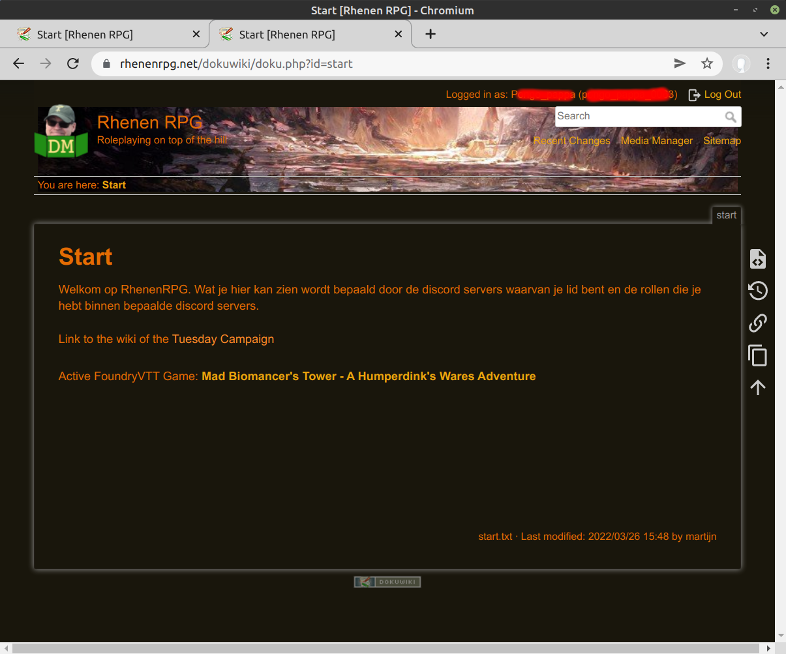
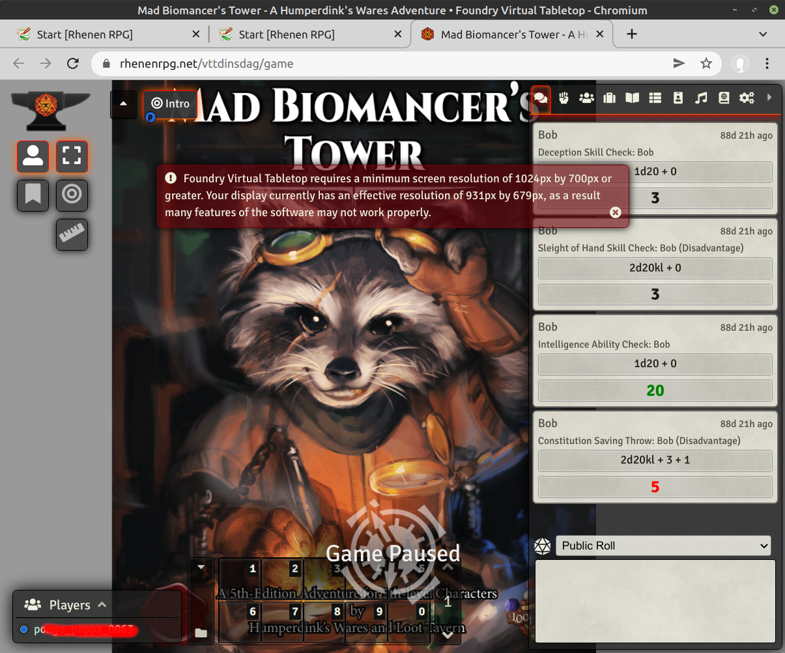
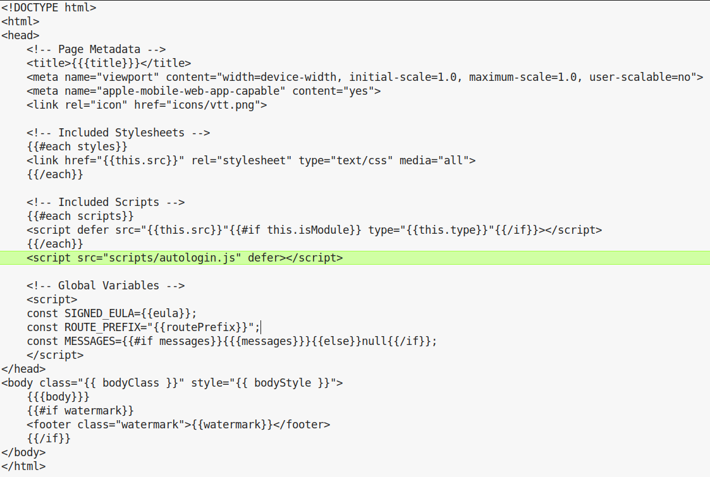

## Foundry Autologin

User management has not been a priority in the development of FoundryVTT. FoundryVTT user management has drawbacks, some IMHO unacceptable from an UX perspective:
  * The admin/mastergm has to add users manually and set their passwords manually;
  * Passwords are hashed on the server with a one-way hash, the admin has to maintain some form of shadow registration of users and passwords;
  * Users are administrated on world level and if you have different hosts, users (and their passwords) have to be maintained seperately for each game;  
  * If you want a single password for a user, the admin has to sync this password accross all games the user is in;
  * Every time the admin commits a change in the user management page, the game reloads for all connected users.
  
## Foundry Autologin - User Experience

The desirable and implemented user experience is simple. A user logs in with Discord and is presented a start page. The start page shows all FoundryVTT instances that can be accessed.



After clicking on the link FoundryVTT opens the game, voila!



Only caveat is that the username in foundry is the same as the username in discord (plus discriminator).

## Foundry Autologin  - Implementation (for developers only)

Changing user management and the user login experience cannot be done with a module, but FoundryVTT modules are only allowed to run client-side in the browser within the scope of the active world. **This a good choice**. 

However, i still want a better user login experience. The implemented solution requires development in four places, two in dokuwiki and two changes to the FoundryVTT server code.

The sequence diagram of this solution


## Foundry Autologin - Change 1: Dokuwiki foundryvttstatus page

a wiki page 

```
https://rhenenrpg.net/dokuwiki/doku.php?id=foundrystatus
```

that is accessible to all and contains a plugin directive for each foundryvtt instance that can be accessed by all registered users.

```
<foundryvttstatus route="vtttuesday" port="30000">   
<foundryvttstatus route="vttsaturday" port="30001"> 
```

## Foundry Autologin - Change 2: Dokuwiki foundryvttstatus plugin

Copied from [foundryvttstatus plugin](https://github.com/rhenenrpg/dokuwiki-plug-foundryvttstatus):

Usage: 

```
<foundryvttstatus route="vttdinsdag" port="30000">   
```

if the user belongs to group $route, the status is checked of the foundryvtt instance on http://foundryvtt.lan:$port/$route using a custom added API that:
  * returns the status and active world of the instance;
  * adds the user as a foundryvtt user;
  * creates/updates the password from the foundryvtt user (a random password with 24 letters or digits);
  * if the user belongs to group gm$route it will receive  assistant GM permissions and player permissions otherwise;
  * returns the username and password that can be used to login this user in this foundryvtt instance.
If the user belongs to group $route a link to the instance is presented and a hidden password is returned for use by the foundryvtt autologin javascript.

## Foundry Autologin - Change 3: FoundryVTT custom post

Alas this functionality requires foundryvtt core server changes, when adapting the foundryvtt core the update functionality **CANNOT*** be used anymore.
New releases should be manually downloaded, patched and deploy to the server instances. Hosting on linux only requires the folder foundry/resources/app of a foundryvtt version. A folder that only contains public code, minimized code and images. 

The custom post "announce-discord-user" creates a user if it does not exist and assigns/updates it's password and role if needed.

The natural place to add this post seems to be *foundryvtt/resources/app/dist/join.mjs* (i am open to better suggestions). This file is alas minimized, which means:
  * the file has to be made readable and changeable, for this js-beautify is used;
  * the variable names are shortened and can have different letters between different versions, this implies a manual retrofit in each new foundry version;

There are two patches to join.mjs. 

#### Change 1 Patch 1 is the addition of an extra import in the import section.
```
import { testPassword,randomString } from "../../core/auth.mjs";
```

#### Change 1 Patch 2 is located in the method handlePost, below case "join":
```
                break; // important: stop case "join"!
            case "announce-discord-user":
                // config is in t, game in o
                if("::ffff:XX.XX.XX.XX" !== s.socket.address().address) { // check whether dokuwiki calls us
                    logger.warn(`${s.body.action} called from wrong address`);
                    return e.status(403), e.send("ERROR.InvalidAPIKey"), e;
                }		        
                if("VERYSECRETKEY" !== s.headers["mes-api-key"]) { 
                    logger.warn(`${s.body.action} called without the right APIKey`);
                    return e.status(403), e.send("ERROR.InvalidAPIKey"), e;
                }		        
                const t = await db.User.find();
                // choice: store password for user in extra file to avoid it being passed to client as part of user.
                const mapfilename = `${o.world.path}/data/discordusers.json`;
                let map = (fs.existsSync(mapfilename)) ? JSON.parse(fs.readFileSync(mapfilename, "utf8")) : {};
                const userUpdates = {}
                let u;
                for (let e of t) {                                    
                    if ( s.body.username == e.name ) {
                        u = e;
                        a.userid = u.id;
                        if ( s.body.username in map && testPassword(map[s.body.username].password, u.data.password, u.data.passwordSalt)) {
                            logger.info(`${s.body.action} existing discord user ${s.body.username}`);                
                            a.status = "existinguser";
                            a.password = map[s.body.username].password;                                
                        } else {
                            a.status = "existinguser.newpassword";
                            a.password = userUpdates["password"] = randomString(24);
                        }
                    }  
                }
                if (!u) {
                    logger.info(`${s.body.action} create fvtt user for discord user ${s.body.username}`);
                    u = await db.User.create({name: s.body.username}); 
                    a.status = "newuser.newpassword";
                    a.password = userUpdates["password"] = randomString(24);
                }
                if(s.body.role !== u.data.role) {
                    a.status += ".updaterole";
                    userUpdates["role"] = s.body.role;
                }
                if (Object.keys(userUpdates).length) {                    
                    await u.update(userUpdates);        
                    map[s.body.username] = { password: a.password };
                    fs.writeFileSync(mapfilename, JSON.stringify(map));
                }
                a.worldname = o.world.data["name"];
                a.worldtitle = o.world.data["title"];          
```

## Foundry Autologin - Change 4: FoundryVTT autologin.js

autologin.js waits until the join page is fully loaded and then 
  * the retrieve the foundrystatus page from wiki;
  * extract the username and password;
  * login to foundry using that username and password;
  * start the game.

Modules cannot effect the join page, so the second server change adds autologin.js and patches the main.hbs to include autologin.js.

### Change 4 Patch 1: Add autologin script
Copy [autologin.js](autologin.js) to foundryvtt/resources/app/public/scripts

### Change 4 Patch 2: load the autologin script 
Add a single line to foundryvtt/resources/app/templates/views/layouts/main.hbs
```
    <script src="scripts/autologin.js" defer></script>
```    
like 



