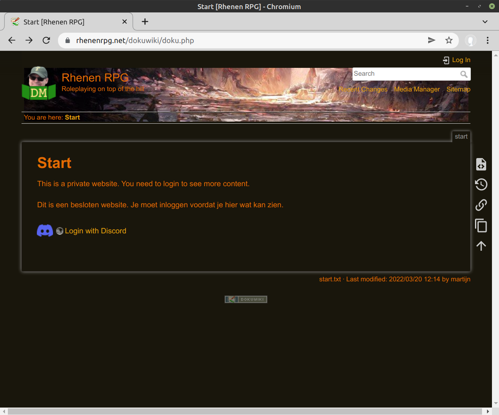
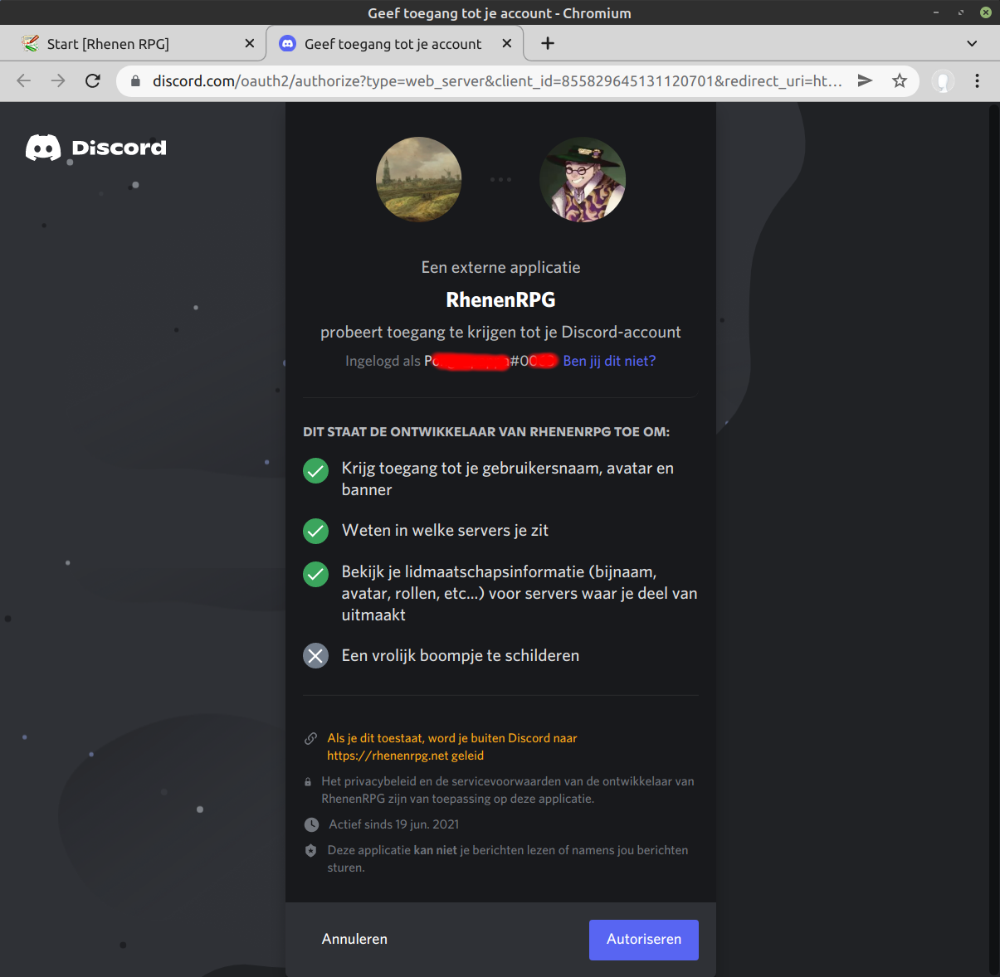

## Discord Login - User Experience

The user will open the website in a browser.

Clicking on 'Login with Discord' yields the discord login page

The user logs in and is asked to authorize the website to be informed of: your username, the servers you are member of and the roles you have in these servers.

When the gives permission, the website uses user username, servers and roles to determine whether the user is granted access to the site and which ACL groups to apply. The site retrieves the least amout of info as made enabled by the discord API. Apart from the discord username and the discord user id none of the discord information is stored/kept on the website.

The logged in example user is assigned the groups to access the **tuesday campaign wiki** and it's associated **foundryvtt instance**, which currently has **Mad Biomancer's Tower** active. Links to the wiki and foundryvtt instance are shown on the start page.

It's not part of the discord login UXP, but when the user clicks the foundryvtt link, the game opens (without the user needing to login and/or input access keys).

## Discord Login - Implementation

The sequence diagram of the Discord Login

ACL Groups are (re)assigned with each login. Changes to discord server membership and discord roles are not monitored real-time, so users will have to logout/login if either changes. 

To enable discord login with ACL group assignment a dokuwiki plugin has been developed, which can be found in a it's own repository: [dokuwiki-plugin-oauthdiscord](https://github.com/rhenenrpg/dokuwiki-plugin-oauthdiscord)
