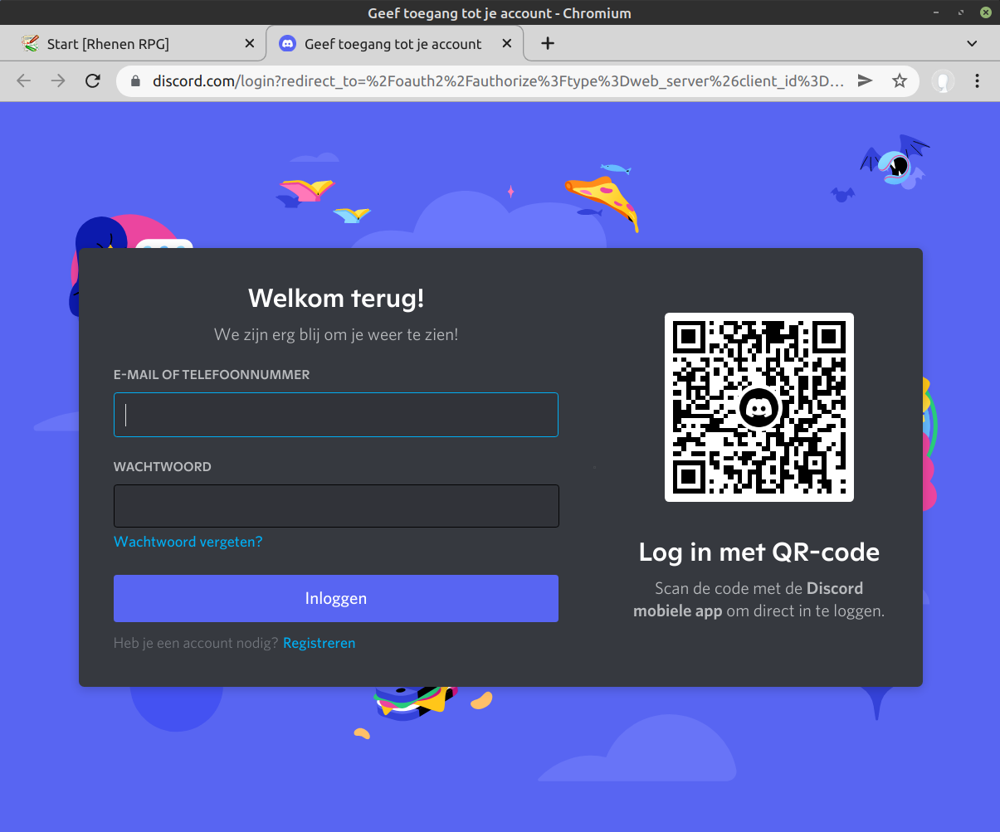

## Discord Login - User Experience

The user will open the website in a browser.

Clicking on 'Login with Discord' yields the discord login page

The user logs in and is asked to authorize the website to be informed of: your username, the servers you are member of and the roles you have in these servers.

