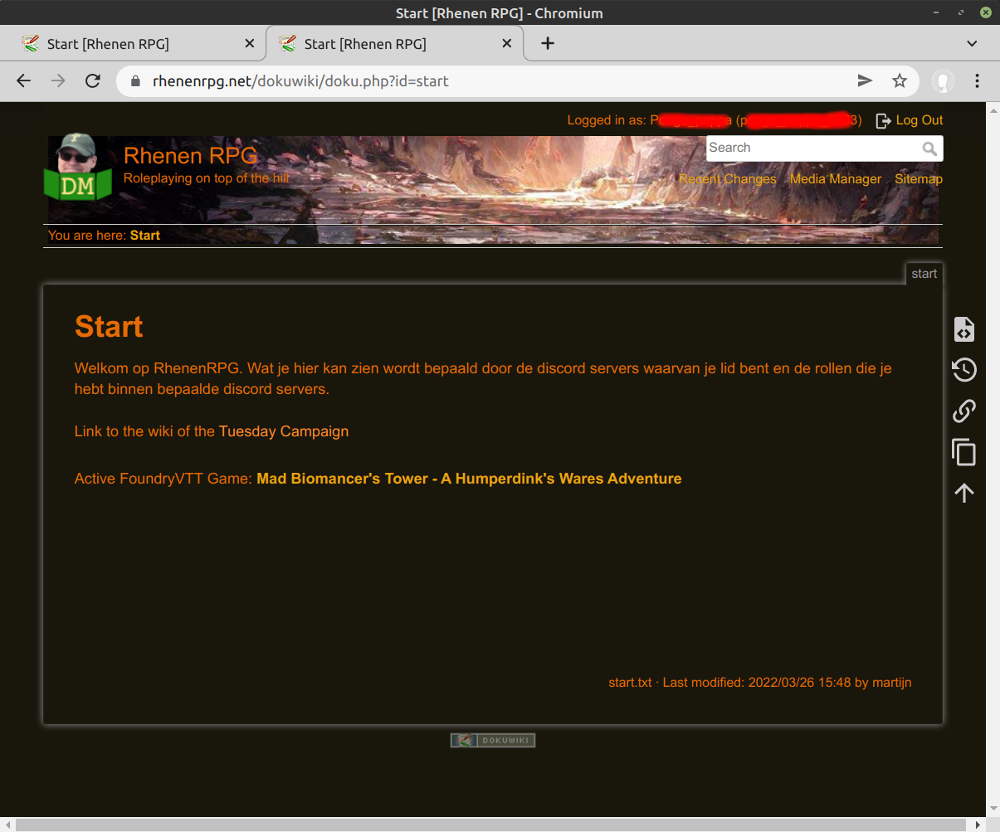

## Discord Login - User Experience

The user will open the website in a browser.

Clicking on 'Login with Discord' yields the discord login page

The user logs in and is asked to authorize the website to be informed of: your username, the servers you are member of and the roles you have in these servers.

The website uses user username, servers and roles to determine whether the user is granted access to the site and which ACL groups to apply. Apart from the discord username and the discord user id none of the discord information is stored/kept on the website.

