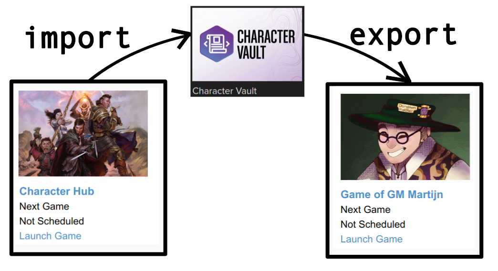

## Roll20 solution for Community Play (aka Multi-GM Multi-Player).

This section describes a solution to organize Community Play in Roll20. Community Play initiatives can be played in Roll20 as-is, but a few conventions and helper scripts make it a lot faster and easier. 

This solution is intended for Community Plays with one roll20 campaign acting as Character Hub. When the initative and the amount of character grows, there can be a Character Hub for each Tier of Play. The compendiums in the Character Hub are curated to only have content available that is agreed by the gamemasters. All players create and store their character in the Character Hub. The Gamemasters use the GM Notes to note when characters have participated in a session and how many XP/loot was gained. A group of Gamemasters with good knowledge of the gamesystem can be tasked with validating characters, to make it easier for new gamemasters to start playing.
 
Each GM uses it's own Play campaign(s) during sessios. Some GMs prefer a single play campaign, other GMs like to make a seperate play campaign for each different adventure; both are fine. Before a session the GM copies the participating characters to their play campaign using the character vault. After a session the GM register the fact that the characters played in the gmnotes of the original characters in the characterhub. The copy of the character in the play campaign is not used anymore and can be removed from the GM game.

Characters are moved between games using the character vault:

This is how games from a Community Play can look like in Roll20:

## Characterhub

Characters are created and maintained in the characterhub. The Character Hub is created by someone with a Roll20 Pro subscription for three reasons:
  * the owner of the Character Hub should have a lot of roll20 compendia to be able share and curate content available in the charactermancer,
  * to allow all players to import/export characters regardless of subscription,
  * to run the CommunityPlaySupport roll20 mod.  
  
### Curation of Compendium Content

The compendiums in the Character Hub are curated to only have content available that is agreed by the gamemasters. This means that the creator needs to explicitly share all compendiums that AND explicity block all other compendiums. All players create and store their character in the Character Hub. 
Note that the owner of the Characterhub needs to turn on Compendium Sharing when creating the game and then *never* turn it off again.

### Characterhub - Roll20 Mod

The [Roll20 Community Play Support mod](https://github.com/rhenenrpg/rhenenrpg.github.io/blob/main/mgmp/roll20/CommunityPlaySupport.js) provides the following functionalities:

#### New/Open Character Button
(If the setting playerCharacterLimit is larger than 0) Every time a player launches the characterhub campaign, a button is shown in the chat. This button will either be a new character button or a open character button.

The Open Character button is shown when a player has reached the maximum number of allowed characters or when there is already a character with the 'new' name. The Open Character button opens the characer with the 'new' name or a random other character.

The New Character button is shown when a player still is allowed to create characters and when there is no character with the 'new' name. When the player presses the new character button:
* a new character is created;
* the character is assigned to the player;
* the roll20 accountid of the player is stored in attribute **ffwplayerid** so characters can be automaticallty assigned in GM games (see below).
After clicking the button, the player can open the new character and use the charactermancer to stat it out.

If the setting playerCharacterLimit is set to 0, the mod never shows buttons.

**Note:** Roll20 recently introduce a +Character button that can be used by all players. 

#### Enforce character naming convention

GMs see all characters in the hub and there can be many, hence a naming convention of **charactername (player displayname)** is enforced. 
Enforcement takes place whenever a charactername changes, a player display name changes and when a player (re)launches the campaign.

#### Create or Update defaulttoken

Until recently roll20 did not allow players to change the tokens of their character, but players were and still are allowed to set the avatar of their characters. 
If the setting avatarIsDefaultToken is on, the defaulttoken of character is automatically set when the avatar changes and/or when the charactername changes.
The script creates a defaulttoken based on the avatar. The name displayed below the token is without *(player displayname)* and bar1 and bar2 are filled/linked to HP and AC of the linked character. Settings for dynamic lighting left empty, when the script was developed dynamic lighting was in flux and it was decided to use manual fog only.

#### Characterhub mod - !cps --fix command

Because of note 1) there is are two command that check and if needed update all characters in the characterhub. All reporting is send to the API log.

#### Characterhub script - Note 1) APIscripts crash or stop working

API Scripts have the tendency to stop working for no reason. A manual restart is required. When a player does not see the button, it is clear that a restart is needed. However. when an event-trigger is not handled, this can be unnoticed (change gmnotes, change name, change avatar)

## Play Campaign
Each GM uses their own play campaigns. A play campaign has to be created by a someone with a roll20 account and a Pro Subscription to enable importing. The same script as in the Characterhub can be used here, but a GM can also choose to assign characters manually to players.

## Play Campaign script - assigning imported characters

Every time a character is added or a player comes online, the script checks whether there are characters with an attribute **ffwplayerid** that are not assigned to the player with the registered roll20 account id. If so, the character is assigned to that player. 

## Transporting characters with the Charactervault

It is perfectly doable to transport characters from the hub to a play game manually, but thanks to the right setup i normally perform this at the start of the session. With all players in a discord video channel watching life.

To transport characters from the hub to a play game three [Google Chrome bookmarklets](booksmarks-ffw.html) have been created. These bookmarklets ONLY work in Google Chrome. Before the workflow and each bookmarklet is described, please watch this [small video](roll20-character-transport.mp4).

#### Transport characters - step 1 - select tokens

In the characterhub the GM drops the tokens of the characters that will join the session on a private page.

#### Transport characters - step 2 - transport characters from the hub into the vault

Execute the bookmarklet **CharVault Import All Characters from this page** and all characters on the page are imported to the Character Vault. 

#### Transport characters - step 3 - transport character from the vault to the play game

Open or Refresh the roll20 Character Vault page. 
In the dropdown box of the first character, select the play campaign.
Execute the bookmarklet **CharVault Export All** and all characters in the Character Vault are exported to the play game. 
*Recently the Character Vault Page has been paginated. So there is now a limit to the number of characters in a party. *

#### Transport characters - step 4 - go to the play campaign
And play!
